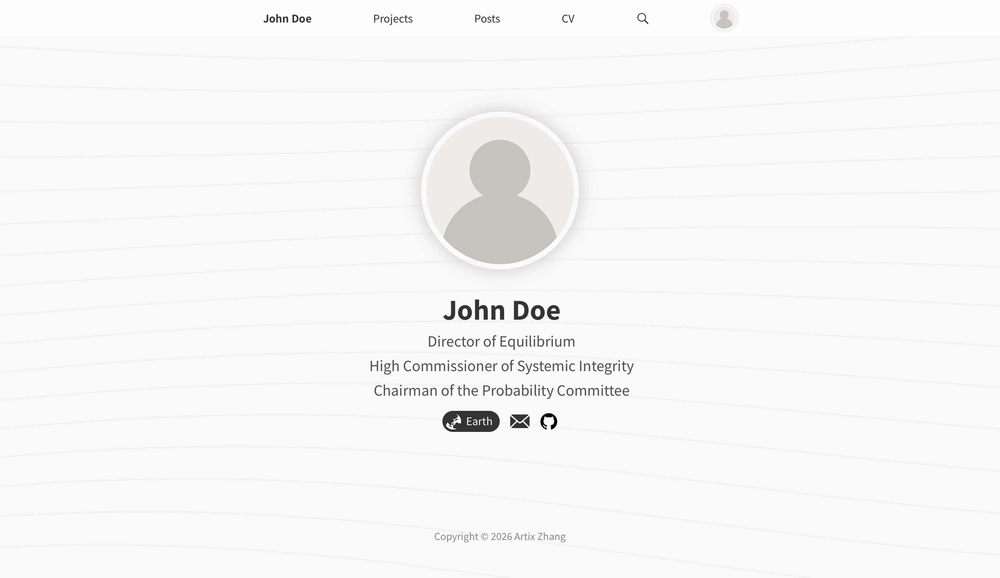

# Artilens

A Personal Website Template.



## Deployment

1. Clone the repo.

```shell
git clone https://github.com/7Artix/Artilens.git
cd Artilens
```

2. Create the `data/` directory of the static assets, with the template. 

```shell
cp -r data_template ../data # A data dir name can be chosen
```

3. Create a `.env` file to specify the `data/` directory.

```shell
echo DATA_PATH=../data > .env # Use the data dir name above
```

$$
\cdots
$$